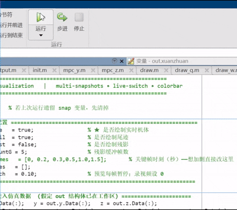
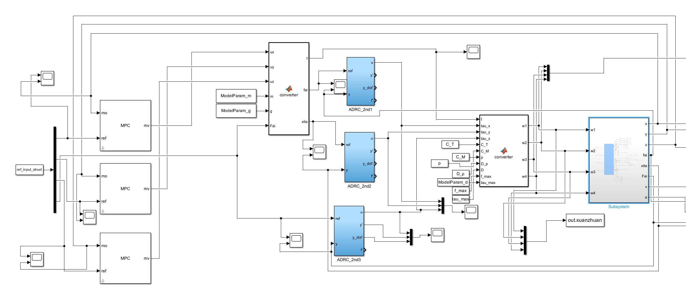
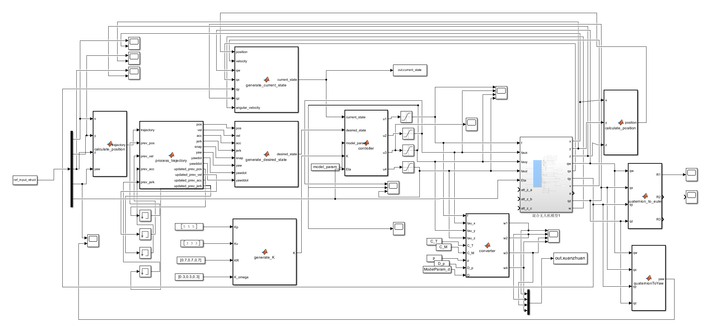
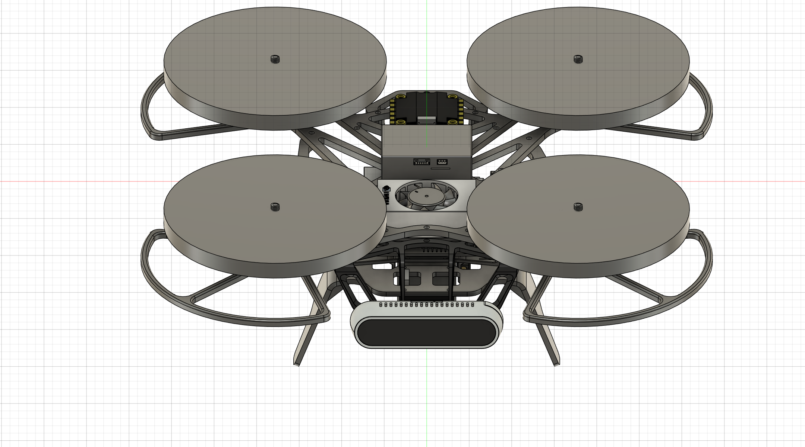
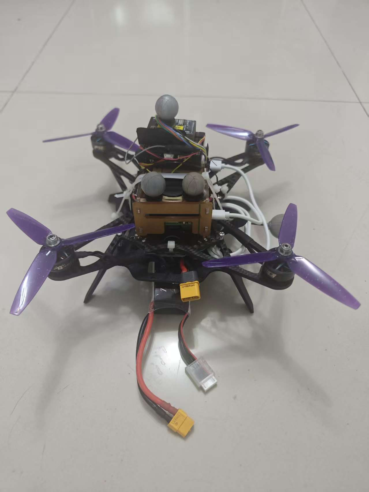
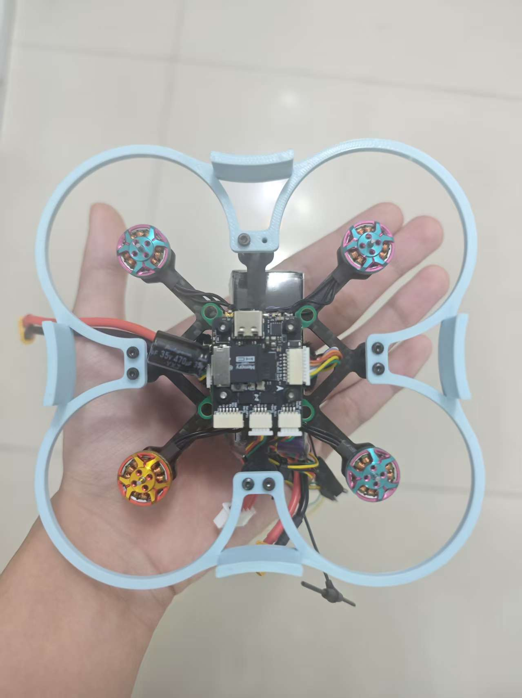
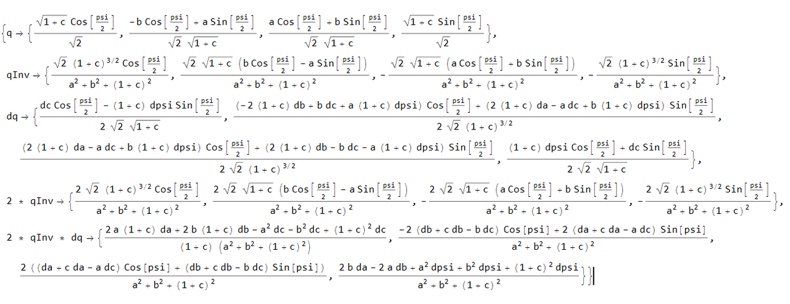
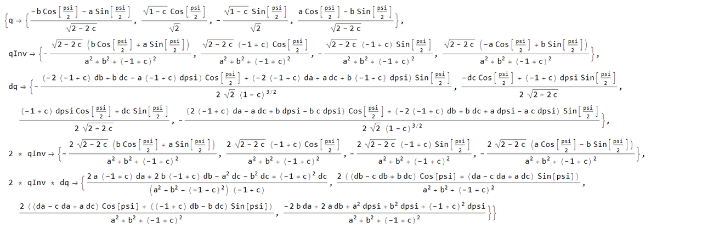
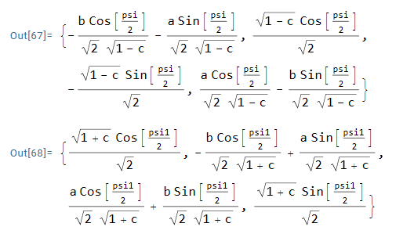

# Bidirectional Thrust Control for Quadrotor Safety

This repository is the companion code for this paper, which has been submitted to RA-L. MATLAB and Simulink are used as the simulation. 

MATLAB part contains two controllers, a full quadrotor model and a minimum snap planner, along with many small plugins.

The code for real-world experiments via PX4 is also provided. 

The recommended hardware configuration will also be provided.

For the most difficult part of the paper to deduce manually, we have also provided the code of the symbolic operation software mathmetica 14 to support it.

Please **note** that if you plan to use the bidirectional function of the drone, please pay attention to safety as it is very **dangerous!**

This is mainly developed by ___



# Installation

The code was tested with MATLAB R2022b, Python 3.12 and ROS2 humble.

The communication of PX4 and ROS is based on [DDS](https://github.com/eProsima/Micro-XRCE-DDS-Agent)

The [PX4](https://github.com/PX4/PX4-Autopilot/releases) version is 1.15

# Usage

Usage tutorial and result presentation video: https://drive.google.com/drive/folders/1Y6ASiIMQH6AqQtt6wm21OfazETRb6CwF?dmr=1&ec=wgc-drive-globalnav-goto

For MPC+ADRC Controller



```
1. Open summary.slx with Simulink
2. run init.m (remember to cd your file to the MPC+ADRC Controller) to initialize the parameters
3. run the main.m in my-minimum-snap file to genertate your own path (Click the select path point with your mouse and press Enter to generate the path)
or
run hover.m to keep the drone hovering directly
4. Finally, run the simulink model. The relevant motion data of the drone can be seen in the workspace and visualized using draw_real.m, draw_q.m, and draw_w.m

To add disturbance, you can change it in MPC.m
```

For Flipping Controller



```
1. Open main.slx with Simulink
2. run init.m (remember to cd your file to the Flipping Controller) to initialize the parameters
3. run the simulink model. The relevant motion data of the drone can be seen in the workspace and visualized using draw_real.m, draw_q.m, draw_w.m, draw_morecool.m(please run the draw_xxx.m in sequence) 
```

# Quadrotor Models

We have developed a total of two quadrotors, one 5-inch and the other 2-inch.

We have provided the 3D modeling models of both in the Quadrotor Models folder, and our rack can be easily replicated through 3D printing.

For safety reasons, it is recommended to try a 2-inch aircraft when using the bidirectional function for the first time.

The 5-inch one has two compressed files because of the github's file limit of 50MB, you can also download the full model [here](https://drive.google.com/drive/folders/1bn4B6WfJLuRSHyve-8CTmcRvIymV1JRM?usp=sharing)




| Module Category                       | Model / Specification | Key Parameters                                 | Description                                                  |
| :------------------------------------ | --------------------- | ---------------------------------------------- | ------------------------------------------------------------ |
| **Flight Control Unit**               | Pixhawk 6C Mini       | 480 MHz 32-bit ARM Cortex-M7                   | Executes attitude estimation and control commands            |
| **Onboard Computer**                  | Raspberry Pi 5 B      | 2.4 GHz × 4 CPU                                | Runs ROS 2 nodes, PX4 RTPS communication, and perception algorithms |
| **Motor System**                      | T-MOTOR F60 PRO IV    | Thrust ≈ 1526 g @ 14.94 V KV2550 (5-inch prop) | Generates lift and attitude control torque                   |
| **Electronic Speed Controller (ESC)** | EMAX formula 45A      | Supports DShot 600 and AM32/Blheli32           | Controls motor speed and direction                           |
| **Propeller**                         | GEMFAN 513D           | Full symmetry                                  | Supports reverse thrust for aggressive maneuvers or braking  |



| Module Category                       | Model / Specification | Key Parameters                                    | Description                                                 |
| :------------------------------------ | --------------------- | ------------------------------------------------- | ----------------------------------------------------------- |
| **Flight Control Unit**               | Micoair NxtPX4v2      | STM32H743VIH6@480MHz                              | Executes attitude estimation and control commands           |
| **Onboard Computer**                  | None                  | None                                              | Temporarily connected to the laptop via a wired connection  |
| **Motor System**                      | GTS V3 1303plus       | 16.9 V KV6000 (2-inch prop)                       | Generates lift and attitude control torque                  |
| **Electronic Speed Controller (ESC)** | NeutronRC Mini 55A    | Supports DShot 600 and AM32                       | Controls motor speed and direction                          |
| **Propeller**                         | GEMFAN 2023           | Reverse rotation has approximately 70% efficiency | Supports reverse thrust for aggressive maneuvers or braking |

# Real-world experiment with PX4


**Note!!!:** Real-world experiments can be extremely dangerous, even if you adopt our 2-inch model. You should understand how the code works. Please make sure you know what you are doing.

We only provide demo node scripts controlled by offboard. For communication and external positioning, please deploy according to your own situation. And all the parameters of the aircraft should also be changed to your own.


# Mathmetica

The results of the three code blocks are as follows:





